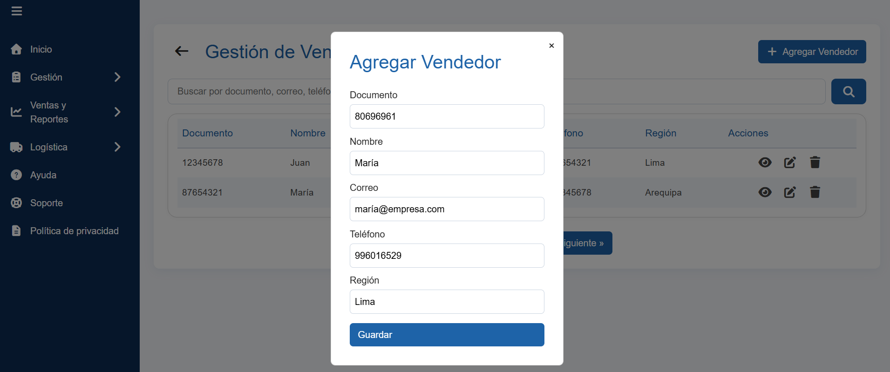

# MISO-ProyectoFinal1

Proyecto Final 1 - MediSupply

## Descripción
Este proyecto Angular permite administrar proveedores, productos y vendedores con una interfaz moderna, filtros de búsqueda, navegación intuitiva y CRUD completo.

## Requisitos
- Node.js (v18 o superior recomendado)
- Angular CLI
- Git

## Instalación y uso

### 1. Clonar el repositorio
```sh
git clone https://github.com/wilderlopezm2024/MISO-ProyectoFinal1.git
cd MISO-ProyectoFinal1
```

### 2. Instalar dependencias
```sh
npm install
```

### 3. Ejecutar la aplicación
```sh
ng serve
```
La app estará disponible en [http://localhost:4200](http://localhost:4200)

## Estructura principal
- `src/app/proveedores` - Módulo de proveedores
- `src/app/productos` - Módulo de productos
- `src/app/vendedores` - Módulo de vendedores
- `src/app/dashboard-admin` - Dashboard principal
- `src/app/menu-principal` - Menú principal

## Funcionalidades
- Listado, búsqueda y filtrado de entidades
- Agregar, editar y eliminar registros
- Navegación entre módulos
- Diseño responsivo y moderno

## Capturas de pantalla

### Dashboard


### Productos


### Proveedores


### Vendedores


### Vendedores (extra)


## Autor
Grupo 11

---
¿Dudas o sugerencias? Abre un issue en el repositorio.
