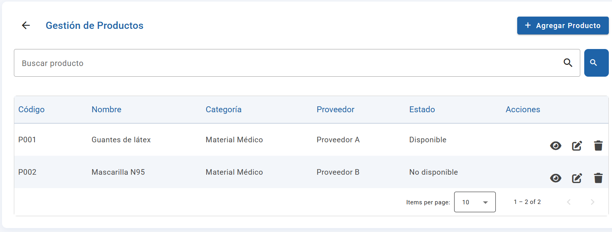
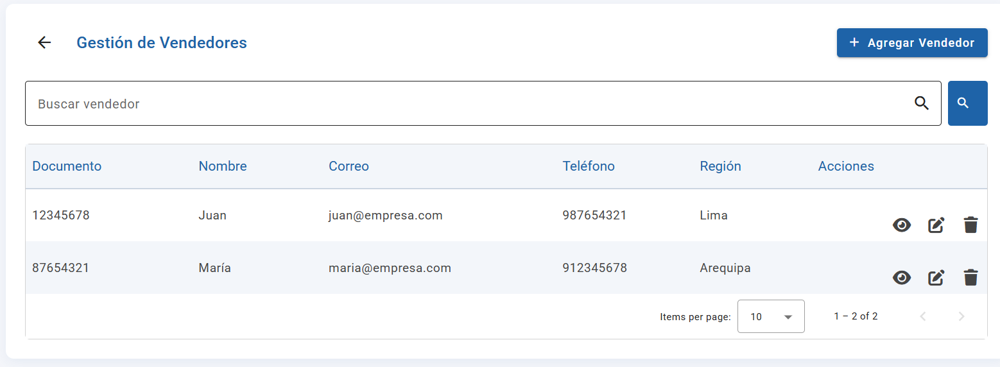

# MISO-ProyectoFinal1


### 1. Instalar dependencias
```sh
npm install
```

### 3. Ejecutar la aplicación
```sh
ng serve
```
La app estará disponible en [http://localhost:4200](http://localhost:4200)

## Estructura principal
- `src/app/proveedores` - Módulo de proveedores
- `src/app/productos` - Módulo de productos
- `src/app/vendedores` - Módulo de vendedores
- `src/app/dashboard-admin` - Dashboard principal
- `src/app/menu-principal` - Menú principal

## Funcionalidades
- Listado, búsqueda y filtrado de entidades
- Agregar, editar y eliminar registros
- Navegación entre módulos
- Diseño responsivo y moderno


## Capturas de pantalla y recursos visuales

### Dashboard principal


### Productos


### Proveedores


### Proveedores - Carga masiva


### Vendedores


### Metas


### Rutas


### Reporte de ventas


## Justificación de diseño

### Colorimetría

**Color primario azul (`--color-primary`):**
- El azul transmite confianza, profesionalismo y seguridad, valores esenciales para aplicaciones empresariales y de gestión.
- Es un color que no genera fatiga visual, ideal para interfaces de uso prolongado.
- Las variantes de azul para hover y active refuerzan la jerarquía visual y la interacción, manteniendo coherencia y dinamismo.

**Colores de estado (verde, naranja, rojo):**
- Se utilizan para comunicar estados de éxito, advertencia y error, siguiendo convenciones universales y facilitando la interpretación inmediata.

**Fondos claros y contrastes:**
- Los fondos blancos y grises claros aseguran máxima legibilidad y un aspecto moderno y profesional, permitiendo que los elementos interactivos y la información relevante destaquen.

---

### Tipografía

**Fuente base sans-serif (`Inter, Roboto, Arial, sans-serif`):**
- Las fuentes sans-serif son estándar en aplicaciones web modernas por su alta legibilidad y aspecto profesional.
- `Inter` y `Roboto` están diseñadas para interfaces digitales, optimizadas para distintos tamaños y resoluciones, mejorando la experiencia en escritorio y móvil.
- El uso de una familia de fuentes con fallback garantiza compatibilidad y consistencia visual en todos los sistemas y navegadores.

**Jerarquía y peso:**
- Títulos y encabezados usan mayor peso y tamaño para guiar la atención y facilitar la navegación visual.
- Textos secundarios y de ayuda emplean tonos grises y menor peso para no competir con la información principal, manteniendo la interfaz limpia y ordenada.

---

### Resumen

La elección del color azul y la tipografía sans-serif responde a principios de usabilidad, accesibilidad y percepción profesional, asegurando que la aplicación sea confiable, agradable y fácil de usar para cualquier usuario.

## Autor
Grupo 11
